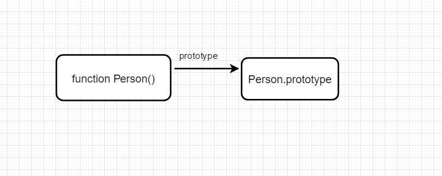
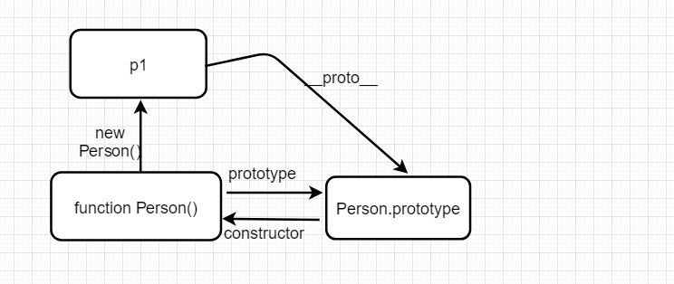
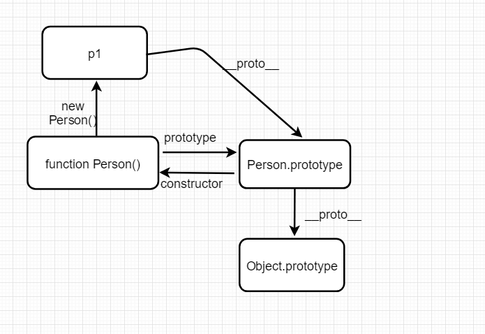
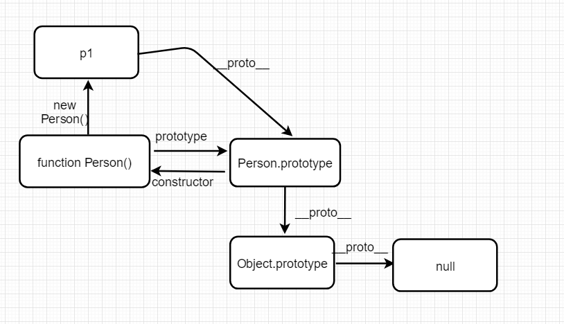
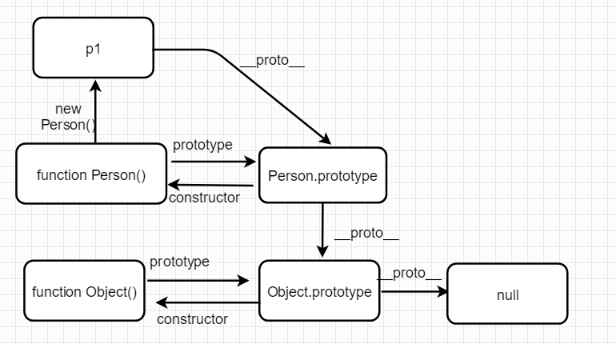

## 前言
前段时间离职了，裸辞的那种，然后马不停蹄的就开始投简历，面试，在面试中被问到你能说一下原型和原型链吗或者是你能画一下原型链图吗的问题，当时我的表情是这样的，


然后只能凭着自己仅有的一点点记忆画了一下图，最后还是说这个我没有理解到位！唉，心里面一万个后悔没有好好研究一下原型。所以就有了这篇文章，希望通过自己的记录，加深自己的理解，也希望看过的人能够把这个知识点理解清楚。

## 对象
对象分为普通对象和函数对象

### 普通对象
- 最普通的对象：具有_proto_属性并指向原型链，没有prototype属性。
- 原型对象：person.prototype，原型对象还有constructor属性并指向构造函数对象

### 函数对象
- 通过new Function()创建的都是函数对象。有_proto_,prototype属性。

## 原型对象
每创建一个函数，这个函数下都会有一个prototype属性，这个属性指向的对象就是原型对象。例如我们创建一个构造函数Person()，我们实例化一个对象p1，这个p1对象可以访问Person.prototype下的属性，所以原型对象也是构造函数的一个实例对象，相当于创建构造函数Perosn()的时候创建了一个实例，并把这个实例赋值给了prototype。
```js
function Person(name) {   // 创建Perosn() 构造函数
	this.name = name
}

Person.prototype.say = function() {    // 在原型对象添加方法say()
    console.log(this.name)
}

var p1 = new Person('桐先生')   // 实例化对象p1
p1.say()   // 桐先生
console.log(p1.__proto__)   // {say: ƒ, constructor: ƒ}
console.log(Person.prototype === p1.__proto__)  // true
```
我们知道p1是实例化对象，也就是一个普通的对象，有__proto__属性并指向原型链，所以我们打印p1.__proto__可以看到是一个对象，里面有我们之前在Person.prototype中添加的say()方法。接着我们打印Person.prototype === p1.__proto__结果是true，说明他们指向的是同一个对象。

## 原型链
我们知道__proto__ 是每个对象都有的属性，prototype是构造函数的属性，他们指向的是同一个对象。所以接着上面的例子我们打印：
```js
console.log(p1.__proto__.__proto__) // {constructor: ƒ, __defineGetter__: ƒ, __defineSetter__: ƒ, hasOwnProperty: ƒ, __lookupGetter__: ƒ, …}
```
打印结果是一个对象，那它也必有__proto__属性，所以我们继续打印：
```js
console.log(p1.__proto__.__proto__.__proto__)   //null
```
打印结果是null，由此我们可以总结访问一个对象的属性时，如果对象内不存在这个属性，那么就会访问__proto__属性，如果还是找不到，就再继访问__proto__属性继续找，直到null为止。这样由原型形成的链式结构就称为原型链。接下来我们用画图的方式一步一步理解原型链。

之前提到每个函数都有prototype属性，所以



在Person.prototype下有个constructor方法，我们尝试的输出它：
```js
console.log(Person.prototype.constructor)   //  Person(name) {this.name = name}
```
打印结果是Person()函数，说明原型的constructor是指向这个函数本身的，所以


我们实例化对象p1也是能访问到原型对象的，所以有



Person.prototype指向的是原型对象，每个对象也有一个__proto__属性，那这两个是不是指向同一个对象的呢？
```js
var obj = new Object()
console.log(Person.prototype.__proto__ === obj.__proto__)   //true
```
结果是true，说明这两个指向的是同一个对象，即指向的是Object.prototype，所以打印
```js
console.log( Person.prototype.__proto__ === Object.prototype)   // true
```
结果是true，所以有



之前我们验证过p1.__proto__.__proto__.__proto__结果是null，也就是Object.prototype.__proto__结果为null，所以



我们看到Object.prototype下也有constructor方法，那么应该也是指向一个构造函数。所以打印
```js
console.log( Object.prototype.constructor)  // Object() { [native code] }
```
结果是一个Object()的函数，所以有



到这基本整个原型链就出来了，也许你会觉得怎么跟我在其他地方看到的不一样，确实在很多文章中可以看到下面这张很经典的图：


我觉得能理解到这，后面的都可以自己尝试着打印去理解，毕竟分析的js原型的文章已经很多了。

## 总结
js原型及原型链的知识点还是很重要的，虽然平时用的少，但是面试的时候确实是经常被问到的，而且确实也能看出你的js基础怎么样，所以这块的知识还是要重视的。以上是我自己对js原型及原型链的简单分析和理解，如果有些地方分析的不到位，还请留言指出，感谢阅读。

<Vssue title="Vssue js" />


