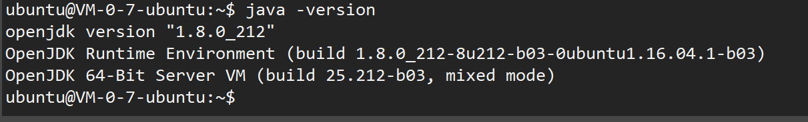
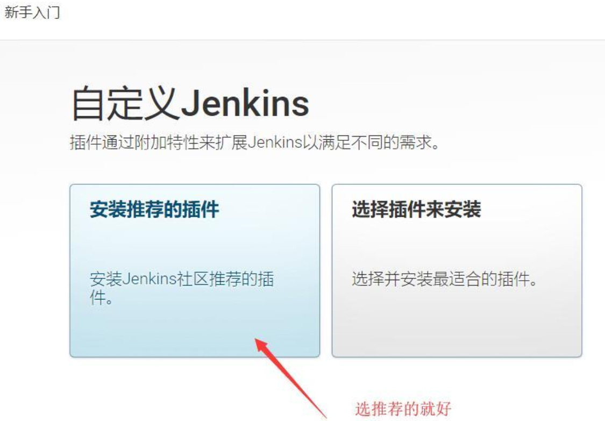
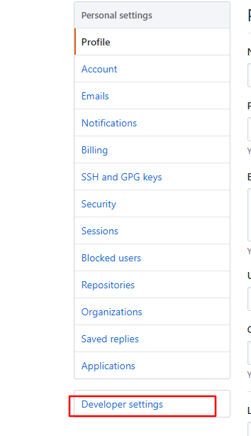
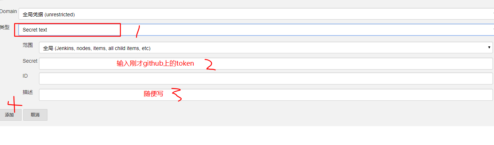
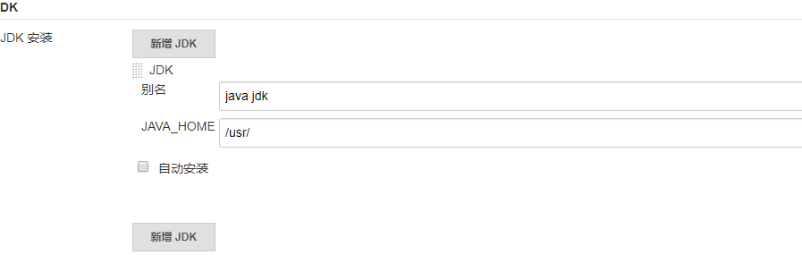
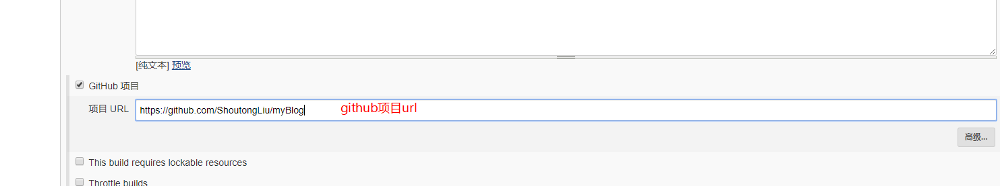
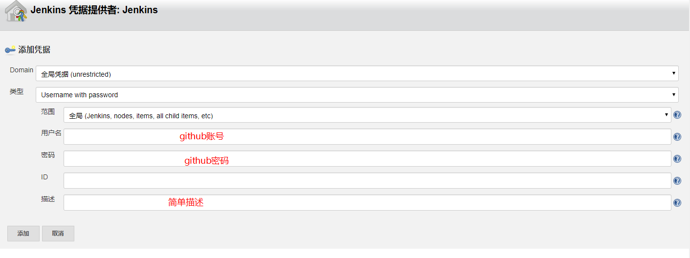
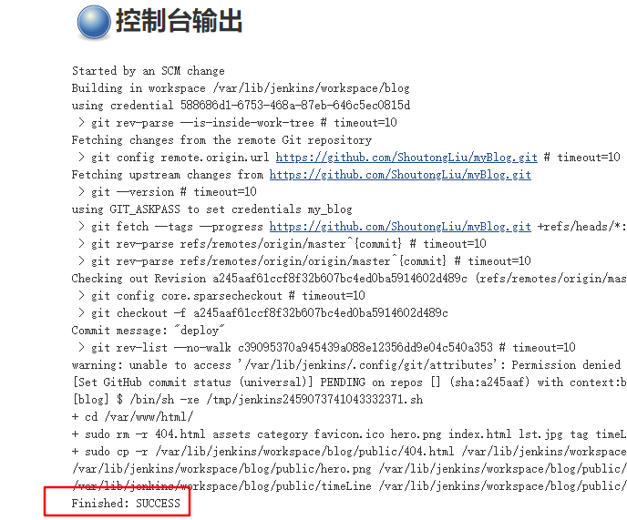

## 前言
最近在搭建一个自己的网站，网站框架搭好了要把项目放到服务器运行，但是每次更新网站内容就要手动部署一次，是在很麻烦，于是就想搭建一套自动化部署的服务。看了一些案例最后选用现在比较主流的Jenkins + Github + Nginx的方案来搭建，花了很多精力才搭建完成，看了很多教程其实不是太完整，就想写下自己搭建的过程分享出去。以下操作默认大家已经申请自己的服务器，并开放所需要的端口。我自己的服务器是ubuntu。注意：ubuntu使用（apt-get install  软件名） 来安装软件，redhat服务器使用（yum install  软件名） 命令安装，使用的是xhell远程控制工具。

## 自动化部署原理
简单的说就是当我们写好代码build完成后，把代码提交到github上，jenkins监测到代码变化就会自动构建项目，把代码拉取到服务器，从而实现自动部署。

## 安装java sdk
第一种安装方式是从包管理工具中安装，即执行以下命令，这里我装的是jdk8.
第二种是从官网下载安装包解压到指定文件夹下，这种方式比较容易出错，不建议使用。
```
sudo apt-get update
sudo apt-get install openjdk-8-jdk
```
安装完成后配置环境变量，执行sudo vi ~/.bashrc，在文件的最后添加以下信息，注意把JAVA_HOME改成你自己的
java路径，我的默认安装路径是/usr/lib/jvm/java-8-openjdk-amd64

```
#set oracle jdk environment
JAVA_HOME=/usr/lib/jvm/java-8-openjdk-amd64 
JRE_HOME=$JAVA_HOME/jre
JAVA_BIN=$JAVA_HOME/bin
CLASSPATH=.:$JAVA_HOME/lib/dt.jar:$JAVA_HOME/lib/tools.jar:$JRE_HOME/lib
PATH=$PATH:$JAVA_HOME/bin:$JRE_HOME/bin
export JAVA_HOME JRE_HOME PATH CLASSPATH
```
配置立即生效
```
source ~/.bashrc
```
在执行source ~/.bashrc命令的时候遇到问题 syntax error: unexpected end of file，检查了fileformat=unix没有问题，最后通过cp /etc/skel/.bashrc ~命令还原.bashrc文件, 配置环境变量后执行source ~/.bashrc无报错，输入java -version输出java jdk版本号信息，安装成功。



## 安装nginx
执行以下命令安装nginx
```
sudo apt-get update
sudo apt-get install nginx
```
安装完成后nginx默认打开，在浏览器输入你的服务器ip，就可以看到页面，页面默认路径是/var/www/html，如果没看到，请检查安装时是否报错，以及检查是否已经开放80端口。

## 安装Jenkins
首先，将存储库秘钥添加到系统
```
wget -q -O - https://pkg.jenkins.io/debian/jenkins-ci.org.key | sudo apt-key add -
```
添加密钥后，系统将返回OK 。 接下来，我们将Debian包存储库地址附加到服务器的sources.list ：
```
echo deb http://pkg.jenkins.io/debian-stable binary/ | sudo tee /etc/apt/sources.list.d/jenkins.list
```
然后更新包存储库
```
sudo apt-get update
```
最后安装Jenkins，出现选择输入y即可
```
sudo apt-get install jenkins
```
可能遇到的情况：
apt-get install jenkins报 ERROR: No Java executable found in current PATH: /bin:/usr/bin:/sbin:/usr/s
解决：
1、检查你的PATH_HOME路径是否正确，执行echo $PATH看一下是否有东西

2、执行以下命令，关联一下java的可执行文件。

```
update-alternatives --install "/usr/bin/java" "java" "/usr/java/jdk-12.0.1/bin/java" 1  #换成你的安装路径
update-alternatives --config java
```
问题解决没有问题后，在浏览器输入服务器ip+8080(如：128.22.26.108:8080)，一切正常的话可以显示一下页面：


根据提示路径获取解锁密码，解锁jenkins遇到问cd: secrets/: Permission denied，原因是secrets没有读取权限，给文件夹赋权即可
```
sudo chmod 777 secrets
```
进入目录，打开文件,复制密码
```
sudo vi initialAdminPassword
```
解锁进去后选择安装建议插件



接着等待插件安装完成后，创建一个管理员账户，输入信息，确定即可。

## github配置
在github中选择settings


选择Developer settings



选择Personal Access Token --> Generate new token, 新建一个有读写权限的用户。
如下勾选选项：


确定后生成token，复制下来保存好。

## jenkins配置
登录进jenkins后选择系统管理 => 系统设置 => Github Server 添加信息


添加jenkins凭据



完成后点击连接测试，连接成功信息如下：


然后选择系统管理 => 全局工具配置
在JDK安装中去掉勾选自动安装，在JAVA_HOME中输入java jdk安装的根目录，我的安装根目录是/usr/



完成后回到首页新建任务，填写任务名称，选择构建自由风格的软件项目，点击确定。


### 常规设置



### 源码管理


添加凭据



### 构建触发器
选择轮询SCM，输入出发时间


### 构建
选择执行shell，输入构建脚本


最后保存，点击立即构建，然后项目会有构建进度。


可以在构建历史查看构建状态，圆球是蓝色并且出现success表示构建成功。



在构建时遇到一个报错是执行sudo 命令要输密码，所以没有继续构建下去，最后找到方法是执行sudo visudo，在文件的最后面加上以下信息
```
jenkins ALL=(ALL) NOPASSWD: ALL
```
然后按下ctrl+o保存，接着按下回车Enter，最后ctrl+x退出。
重新构建应该可以成功，成功后可以在/var/lib/jenkins/workspace/路径下看到你的项目了，然后尝试修改本地项目，git push提交后，发现jenkins响应执行构建，服务器文件也更新了，说明项目搭建完成，好好奖励一下自己吧！

## 总结
整个项目搭建下来踩了很多的坑，也遇到很多的小问题，很多时间都是在解决问题，总的来说其实不是很难，如果不熟悉linux的话会有点吃力。以上是我在搭建的过程以及遇到的问题，如果哪里写的不到位，还请指正，谢谢。

<Vssue title="Vssue jenkins" />
