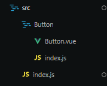
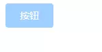
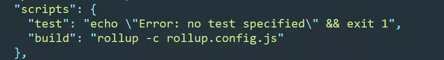
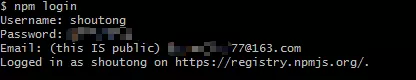
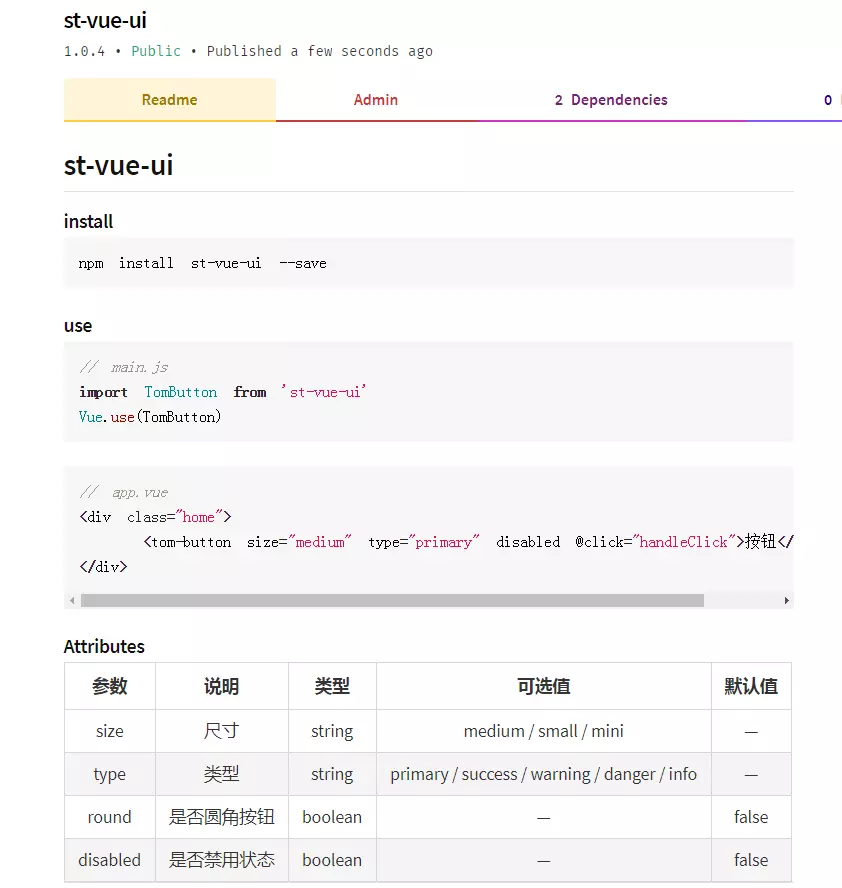

## 引言

> 用过Vue.js开发的童鞋应该都知道ElementUI、Iview、Ant Design of Vue
等UI框架，这些框架给我们日常的开发带来巨大的便利，大大提高了开发效率，有很多公司或者项目组也会有属于自己的UI框架。组件开发在面试中也会被问到，有自己的开源UI框架在面试中也有不少的加分。成就感也自然而然的提高。下面分享一下我最近学习开发的内容。


## 开发前需知

我们使用ElementUI时都知道，导入EelementUI后需要使用Vue.use()才能生效，因为每个插件都应该暴露一个install方法，install 方法调用时，会将 Vue 作为参数传入。Vue.use()也可以传入参数，如Vue.use(MyPlugin, { someOption: true })可自定义全局的设置，在Vue官方文档有关于插件开发的说明，具体可前去学习。

## 实现一个Button插件
### 项目初始化

Vue支持对*.vue文件进行快速原型开发，所以我们就不用脚手架构建项目了，直接在bash窗口执行以下命令创建项目

```bash
$ mkdir my-ui
$ cd my-ui
$ npm init -y
```
在项目中创建以下文件和文件夹，




在Button.vue文件中加入以下代码

```html
<template>
    <div>Hello Vue</div>
<template>
```

要支持Vue原型开发，还需要安装以下两个插件

```bash
$ npm install -g @vue/cli
$ npm install -g @vue/cli-service-global
```
安装完成后执行npm serve Button.vue打开localhost:8080就能看到‘Hello Vue’，接下来我们就模仿EelmentUI的Button完成一个Button插件。

### Button内容及样式
修改Button.vue中template的内容如下：

```html
<template>
    <button
        :class="`tom-button tom-button-${type} tom-button-${size} 
        ${round ? 'tom-button-round': ''} ${disabled ? 'is-disabled' : ''}`"
        @click="onClick"
        :disabled="disabled"
    >
        <slot></slot>
    </button>
</template>
```
然后js部分通过props对象传入值，在methods对象添加方法，使用this.$emit传递事件。

```js
export default {
  name: 'tom-button',
  props: {
    type: {
      type: String,
      default: 'default',
      validator(type) {
        return ['default', 'primary', 'info', 'warning', 'danger'].includes(
          type
        )
      }
    },
    size: {
      type: String,
      default: 'medium',
      validator(size) {
        return ['medium', 'small', 'mini'].includes(size)
      }
    },
    round: {
      type: Boolean,
      default: false
    },
    disabled: {
      type: Boolean,
      defalut: false
    }
  },
  methods: {
    onClick(event) {
      this.$emit('click', event)
    }
  }
}
```
最后给Button加上所以的样式
```css
.tom-button {
      display: inline-block;
      outline: 0;
      font-family: 'Helvetica Neue', Helvetica, Arial, sans-serif;
      user-select: none;
      cursor: pointer;
      line-height: 1;
      white-space: nowrap;
      background-color: #fff;
      border: 1px solid #dcdfe6;
      color: #606266;
      -webkit-appearance: none;
      text-align: center;
      box-sizing: border-box;
      outline: none;
      margin: 0;
      transition: 0.1s;
      font-weight: 500;
      padding: 12px 20px;
      font-size: 14px;
      border-radius: 4px;
    }

    .tom-button.is-disabled {
      color: #c0c4cc;
      cursor: not-allowed;
      background-image: none;
      background-color: #fff;
      border-color: #ebeef5;
    }

    /*背景颜色*/

    .tom-button-primary {
      color: #fff;
      background-color: #409eff;
      border-color: #409eff;
    }

    .tom-button-primary.is-disabled {
      color: #fff;
      background-color: #a0cfff;
      border-color: #a0cfff;
    }

    .tom-button-success {
      color: #fff;
      background-color: #67c23a;
      border-color: #67c23a;
    }

    .tom-button-success.is-disabled {
      color: #fff;
      background-color: #b3e19d;
      border-color: #b3e19d;
    }

    .tom-button-info {
      color: #fff;
      background-color: #c8c9cc;
      border-color: #c8c9cc;
    }

    .tom-button-info.is-disabled {
      color: #fff;
      background-color: #c8c9cc;
      border-color: #c8c9cc;
    }

    .tom-button-warning {
      color: #fff;
      background-color: #e6a23c;
      border-color: #e6a23c;
    }

    .tom-button-warning.is-disabled {
      color: #fff;
      background-color: #f3d19e;
      border-color: #f3d19e;
    }

    .tom-button-danger {
      color: #fff;
      background-color: #f56c6c;
      border-color: #f56c6c;
    }
    .tom-button-danger.is-disabled {
      color: #fff;
      background-color: #fab6b6;
      border-color: #fab6b6;
    }

    /*Button大小*/
    .tom-button-medium {
      padding: 10px 20px;
      font-size: 14px;
      border-radius: 4px;
    }

    .tom-button-small {
      padding: 9px 15px;
      font-size: 12px;
      border-radius: 3px;
    }

    .tom-button-mini {
      padding: 7px 15px;
      font-size: 12px;
      border-radius: 3px;
    }

    /*是否圆角*/
    .tom-button-round {
      border-radius: 20px;
    }
```
然后在Btton文件夹中的index.js给组件添加install方法并导出

```js
import TomButton from './Button.vue'

TomButton.install = function(Vue) {
  Vue.component(TomButton.name, TomButton);
};


export default TomButton
```

最后在src目录下的index.js中导入Button中的index.js并全局导出。

```js
// 引入组件
import TomButton from './Button/index.js'

const components = [
  TomButton
]

const install = function(Vue, opts) {
  if (install.installed) return
  // 遍历注册全局组件
  components.forEach(component => {
    Vue.component(component.name, component);
  });
}

// 用于script标签引入
if (typeof window !== 'undefined' && window.Vue) {
  install(window.Vue)
}


export default {
  install, 
  TomButton
}
```

### 本地测试

到此Button插件就已经完成了，我先在本地测试一下，在根目录新建app.vue文件，导入Button组件：

```vue
<template>
  <div class="home">
	<tom-button size="medium" type="primary" disabled @click="handleClick">按钮</tom-button>
  </div>
</template>

<script>
import TomButton from './src/Button/Button.vue'
export default {
  components: {
    TomButton
  },
  methods: {
    handleClick() {
      console.log('test')
    }
  }
}
</script>
```

在命令窗口执行vue serve app.js打开浏览器不出意外就会显示如下的按钮，鼠标移上去，也有禁用的符号



### 打包插件

本地测试没问题后，就可以打包发布了。打包工具我使用的是[rollup.js](https://www.rollupjs.com/guide/zh)，使用它首先需要全局安装

```bash
$ npm install rollup --global
```
rollup.js默认是不支持打包*.vue文件的，所以要支持打包.vue文件还需要安装以下的包

```bash
$ npm install rollup-plugin-commonjs --save
$ npm install rollup-plugin-vue --save
$ npm install vue-template-compiler --save
```

然后在根目录新建配置文件rollup.config.js，并添加配置代码：

```js
import vue from 'rollup-plugin-vue';
import commonjs from 'rollup-plugin-commonjs';

export default {
  input: 'src/Button/index.js',
  output: {
    file: 'lib/st-vue-ui.js',
    format: 'cjs'
  },
  // 支持.vue文件的打包
   plugins: [
        commonjs(),
        vue(),
    ]
};
```
接着在package.json文件添加一条命令"build": "rollup -c rollup.config.js"，如下图：



完成后在命令窗口执行npm run build命令，打包完成在根目录就会生成lib文件夹，里面的js文件就是打包后的文件。

### 发布到npm

打包完成，接下来就可以发布到npm上了，是不是想想还有点小激动。发布前需要在根目录新建一个.npmignore文件，这个文件和Git的.gitignore文件一样，用于过滤不用上传的文件，.npmignore文件内容如下： 

```
node_modules/
src/
rollup.config.js
app.vue
.gitignore
```

然后在package.json文件添加一些字段，以下是参考配置，了解更多可去[npm官网](https://docs.npmjs.com/files/package.json)查看

```js
 "name": "st-vue-ui",       // 项目名字，npm install + name
 "version": "1.0.3",        // 项目版本号
 "description": "基于Vue的UI插件",      // 项目描述
 "main": "lib/st-vue-ui.js",       //指定了包加载的入口文件，默认值是模块根目录下面的index.js
 "private": false,         // 为false时代表你的包不是私有的，所有人都能查看并npm install使用
 "keywords": ["vue", "UI"],   // 项目关键字
  ```
  
为了让别人更方便的使用自己插件，我们可以加上说明文档。在根目录新建README.md文件，对自己的插件进行简单的介绍，可以下载[typora](https://typora.io/)这个软件对*.md文件进行编辑。


好了，终于可以发布了，发布到npm需要到[npm注册](https://www.npmjs.com/)一个账号，注册完成后，回到项目的命令窗口执行npm login，输入用户名、密码、邮箱登录成功。



然后执行npm publish就可以发布了，第一次发布会遇到报错，提示需要验证邮箱。根据提示去邮箱验证后重新执行npm publish一般都可以发布成功，如图：


发布成功后去自己的主页下查看就可以看到了



现在按照跟ElementUI一样的方法，你可以在自己的项目中使用了。下次更新发布需要修改版本号打包再上传，使用的时候把package.json中包名的版本号改为最新的，然后执行npm install后重启项目就可以了。

## 结语

这里我只做了一个简单的Button插件，如果再写一个插件，就在src建立对应的目录如Input，然后新建Input.vue和index.js，把对应的插件的index.js文件导入即可。搭建一套UI组件库还是挺复杂的，不过通过这个小demo应该可以获得很多的灵感，也对Vue的使用有了更多的学习。目前这个UI框架只能全局引入，不能像ElementUI那样按需引入。目前没有太多时间去学习，之后学习了再做更新，如有思路或者做过的童鞋也欢迎留言指导。以上内容如有写的不到位的，也请留言指正。

## 参考文章

[Vue.js - 构建你的第一个包并在NPM上发布](https://juejin.im/post/5cc8162b6fb9a032106bda83#heading-11)

[记搭建一个Vue组件库](https://chenpt.cc/public-comp/)

## 项目地址

[github地址](https://github.com/ShoutongLiu/tom-vueui)

[npm地址](https://www.npmjs.com/package/st-vue-ui)


<Vssue title="Vssue vueInstall" />
